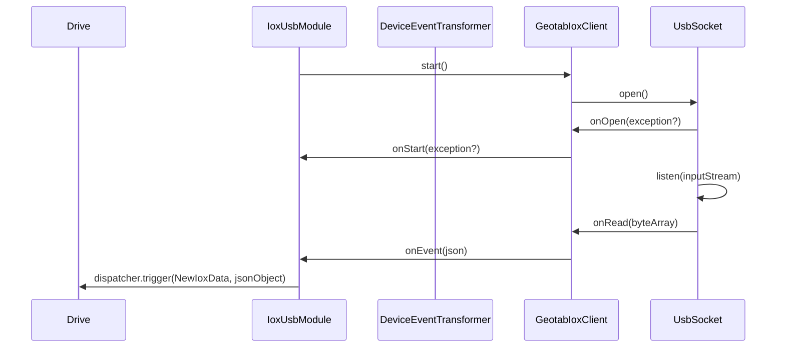
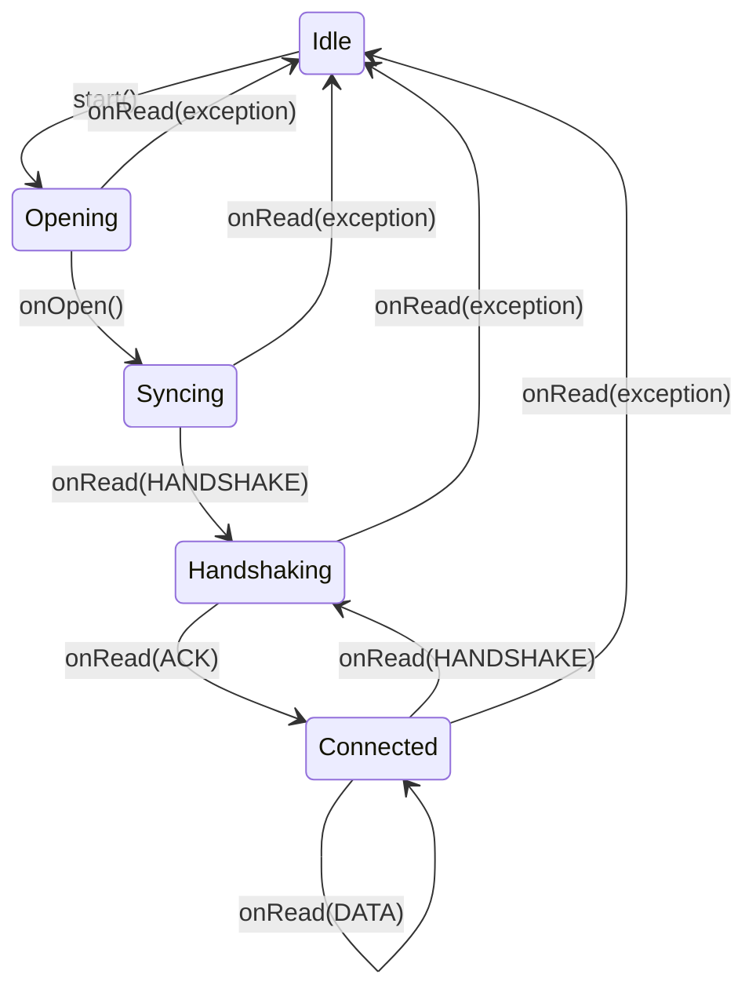

# IOX USB Module

## Module Sequence Diagram

```mermaid
sequenceDiagram
  participant wd as Drive
  participant iuc as IoxUsbModule
  participant tf as DeviceEventTransformer
  participant gic as GeotabIoxClient
  participant usb as UsbSocket

  iuc->>gic: start()
  gic->>usb: open()

  usb->>gic: onOpen(exception?)
  gic->>iuc: onStart(exception?)

  usb->>usb: listen(inputStream)

  usb->>gic: onRead(byteArray)
  gic->>iuc: onEvent(json)
  iuc->>wd: dispatcher.trigger(NewIoxData, jsonObject)
```

## GeotabIoxClient State Diagram

```mermaid
stateDiagram
    Idle --> Opening: start()
    Opening --> Syncing: onOpen()
    Syncing --> Handshaking: onRead(HANDSHAKE)
    Handshaking --> Connected: onRead(ACK)
    Connected-->Connected: onRead(DATA)

    Connected --> Handshaking: onRead(HANDSHAKE)

    Opening --> Idle: onRead(exception)
    Syncing --> Idle: onRead(exception)
    Handshaking --> Idle: onRead(exception)
    Connected --> Idle: onRead(exception)
```
